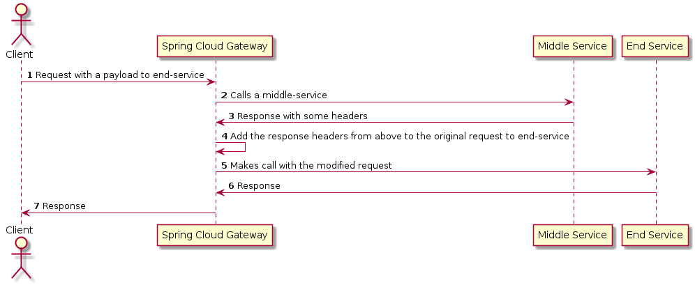

## Spring Cloud Gateway Filters

* gateway-end-service: Simple rest service running on `8090`
* gateway-middle-service: Simple rest service running on `8085`
* gateway-with-filters: Spring cloud Gateway with a custom filter runningon port `8080`

### End Service endpoints

1) GET/POST/PUT `/headers` - Simple endpoint that returns the headers passed to it
2) POST `/upload` - `RequestParam` of `file`. Only prints out in console. This also have an optiona `delay` (in millisecond) param.

Swagger - http://localhost:8090/swagger-ui.html

### Middle Service endpoints

1) GET `/check` - Simple endpoint that returns add a response header

Swagger - http://localhost:8085/swagger-ui.html

### SCG with filters

```
@startuml
autonumber

actor Client as client
participant "Spring Cloud Gateway" as SCG
participant "Middle Service" as ms
participant "End Service" as es

client -> SCG : Request with a payload to end-service
SCG -> ms : Calls a middle-service
ms -> SCG : Response with some headers
SCG -> SCG : Add the response headers from above to the original request to end-service
SCG -> es: Makes call with the modified request
es -> SCG : Response
SCG -> client: Response

@enduml
```

